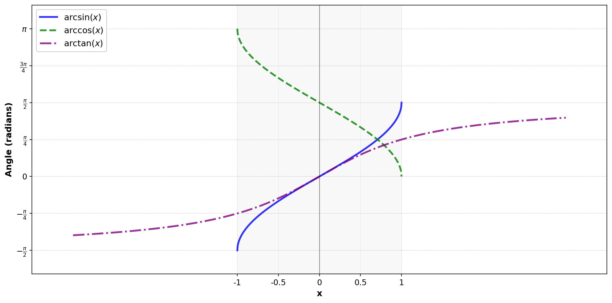

The trigonometric functions sine, cosine and tangent each have an inverse function, which are called arcsin, arccos and arctan respectively. These functions are used to find the angle that corresponds to a given value of sine, cosine or tangent.

As the sine and cosine functions only return values between -1 and 1, the arcsin and arccos functions are only defined for inputs in this range. The arctan function, however, is defined for all real numbers.

As sine, cosine and tangent are all periodic functions, their inverses are not one-to-one. As such, the principal values of the arcsin, arccos and arctan functions are defined as follows:

- The arcsin function returns values in the range $[- \frac{\pi}{2}, \frac{\pi}{2}]$.
- The arccos function returns values in the range $[0, \pi]$.
- The arctan function returns values in the range $(- \frac{\pi}{2}, \frac{\pi}{2})$.

# Notation

You may see these functions referred to using the function names $\arcsin(x)$, $\arccos(x)$, and $\arctan(x)$, or using the notation $\sin^{-1}(x)$, $\cos^{-1}(x)$, and $\tan^{-1}(x)$. Both notations are commonly used in mathematics.

